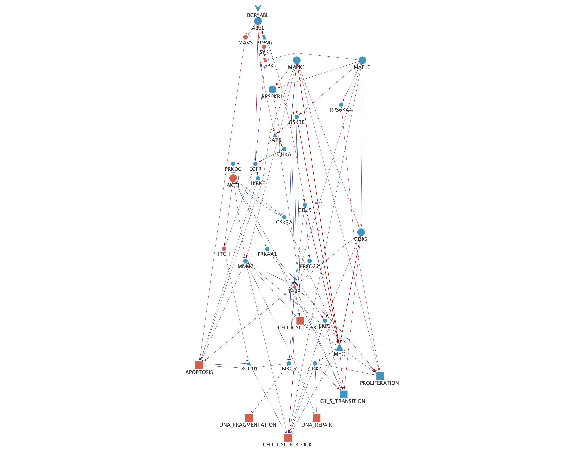
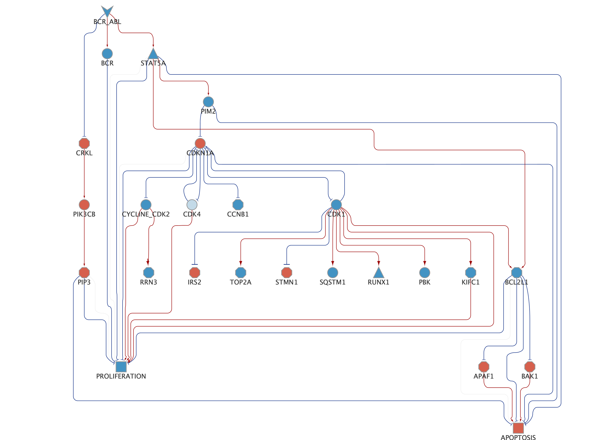
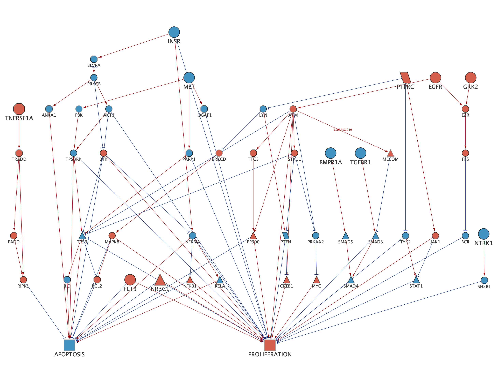

# Intro {.unnumbered}

Template based on [Rmarkdown](https://bookdown.org/yihui/rmarkdown/), using the [united HTML theme](https://bootswatch.com/united/).

Refer to a [sub section](#sub-analysis). Citing an article [@article]. Refer to section [Analysis].

# Input {.unnumbered}

Loading libraries:

```{r Load libraries, message = FALSE}
library(DT)
library(ggplot2)
library(xfun)
library(SignalingProfiler)
library(tidyverse)
library(igraph)
source('./0.libraries.R')
```

# Run SignalingProfiler 2.0 in both conditions

```{r eval = FALSE}
analyses <- c('ima_ctrl', 'res_sens')
cell_lines <- c('LAMA84', 'K562')

solver = 'cplex'
carnival_options = default_CARNIVAL_options(solver)

# =============================================================== #
# Protein activity inference
# =============================================================== #

for(analysis in analyses){

  for(cell_line in cell_lines){

    phospho_df <- read_tsv(paste0('../input/phospho_', cell_line, '_',
                                  #if K562 sens_res and ima_ctrl, if LAMA just ima_ctrl
                                  ifelse(cell_line == 'K562', analysis, 'ima_ctrl'),
                                  '_SP.tsv'))

    prot_df <- read_tsv(paste0('../input/prot_', cell_line, '_',
                               #if K562 sens_res and ima_ctrl, if LAMA just ima_ctrl
                               ifelse(cell_line == 'K562', analysis, 'ima_ctrl'),
                               '_SP.tsv'))

    # Kinase Activity Inference
    kin_phos_activity_foot <- run_footprint_based_analysis(omic_data = phospho_df,
                                                           analysis = 'ksea',
                                                           organism = 'human',
                                                           reg_minsize = 3,
                                                           exp_sign = FALSE,
                                                           integrated_regulons = TRUE,
                                                           hypergeom_corr = TRUE,
                                                           GO_annotation = TRUE,
                                                           correct_proteomics = TRUE,
                                                           prot_df = prot_df)

    # Infer activity from regulatory phosphosites
    phosphoscore_df <- phosphoscore_computation(phosphoproteomic_data = phospho_df,
                                                organism = 'human',
                                                activatory = TRUE ,
                                                GO_annotation = TRUE)

    # Combine footprint- and PhosphoScore
    combined_kin_phos <- combine_footprint_and_phosphoscore(footprint_output = kin_phos_activity_foot,
                                                            phosphoscore_df =  phosphoscore_df,
                                                            analysis =  'ksea')

    toy_kin <- combined_kin_phos
    toy_other <- phosphoscore_df %>%
      dplyr::filter(!mf %in% c('kin', 'phos', 'tf')) %>%
      dplyr::rename(final_score = phosphoscore) %>%
      dplyr::mutate(method = 'PhosphoScore')

    toy_tf <- phosphoscore_df %>%
      dplyr::filter(mf == 'tf')
    toy_tf$final_score <- toy_tf$phosphoscore
    toy_tf$method = 'PhosphoScore'

    # create a unified 'activity modulation' table for the next steps
    prot_activity_df <- dplyr::bind_rows(toy_kin, toy_other, toy_tf) %>%
      dplyr::select(UNIPROT, gene_name, mf, final_score, method)

    ## ProteoScore
    proteo_score_df <-
      SignalingProfiler::activity_from_proteomics(prot_df = prot_df,
                                                  organism = "human")

    ## Combine ProteoScore and Activities

    activity_proteo_combined_filtered <-
      SignalingProfiler::combine_activityscore_proteoscore(activity_score = prot_activity_df,
                                                           proteo_score = proteo_score_df)
    activity_proteo_combined_filtered$final_score <-
      as.numeric(activity_proteo_combined_filtered$final_score)

    prot_activity_total_df <- activity_proteo_combined_filtered

    if(cell_line == 'K562'){
      k562_df <- prot_activity_total_df
    }else{
      lama84_df <- prot_activity_total_df
    }
  }

  if(analysis == 'ima_ctrl'){

    full_join(k562_df, lama84_df, by = c('gene_name', 'mf'), suffix = c('.K562', '.LAMA84')) -> merged_table

    # ggplot(merged_table, aes(x = final_score.K562, y = final_score.LAMA84)) +
    #   geom_point() +
    #   geom_hline(yintercept = 0) +
    #   geom_vline(xintercept = 0)

    merged_table <- merged_table %>% mutate(conc = final_score.K562 * final_score.LAMA84)

    write_tsv(merged_table, paste0('../results/', analysis, '/final_score.tsv'))

  } else {

    write_tsv(prot_activity_total_df, paste0('../results/', analysis, '/final_score.tsv'))

  }

}

# =============================================================== #
# Network creation and optimization
# =============================================================== #

for(analysis in analyses){
  if(analysis == 'ima_ctrl'){
    prot_df_lama <-  read_tsv(paste0('../input/prot_LAMA84_ima_ctrl_SP.tsv'))
    phospho_df_lama <- read_tsv(paste0('../input/phospho_LAMA84_ima_ctrl_SP.tsv'))
    prot_df_k562 <-  read_tsv(paste0('../input/prot_K562_ima_ctrl_SP.tsv'))
    phospho_df_k562 <- read_tsv(paste0('../input/phospho_K562_ima_ctrl_SP.tsv'))

    bind_rows(prot_df_lama, prot_df_k562) %>% distinct(gene_name) -> prot_df
    bind_rows(phospho_df_lama, phospho_df_k562) %>% distinct(gene_name) -> phospho_df

    # Read merged activity
    merged_table <- read_tsv(paste0('../results/', analysis, '/final_score.tsv'))
    activity_df <- merged_table %>% filter(conc > 0) # take only consistent proteins

    activity_df %>%
      filter(method.K562 != 'proteoscore' | method.LAMA84 != 'proteoscore') -> both_not_proteo

    activity_df %>%
      filter((method.K562 == 'proteoscore' | method.LAMA84 == 'proteoscore') & mf == 'tf') -> proteo_tf

    bind_rows(proteo_tf, both_not_proteo) -> activity_df_tot
  }else{
    phospho_df <- read_tsv(paste0('../input/phospho_K562_', analysis, '_SP.tsv'))
    prot_df <- read_tsv(paste0('../input/prot_K562_', analysis, '_SP.tsv'))

    activity_df_tot <- read_tsv(paste0(paste0('../results/', analysis, '/final_score.tsv')))
  }

  # ========================================================================== #
  # Build naive network
  # ========================================================================== #

   # # PKN preprocessing
    PKN_table <- choose_PKN(organism = 'human',
                            with_atlas = FALSE,
                            direct = TRUE,
                            custom = FALSE,
                            custom_path = NULL)

    # Preprocess according to the different condition
    PKN_expressed <- preprocess_PKN(omics_data = list(prot_df, phospho_df),
                                    PKN_table = PKN_table)

    # In the two-layered network separate KIN/PHOS/OTHERs and TFs
    kin_phos_other <- activity_df_tot %>%
      dplyr::filter(mf %in% c('kin', 'phos', 'other'))

    tfs <- activity_df_tot %>%
      dplyr::filter(mf == 'tf')


    naive_network <- two_layer_naive_network(starts_gn = c('BCR_ABL'),
                                             intermediate_gn = kin_phos_other$gene_name,
                                             targets_gn = tfs$gene_name,
                                             PKN_table = PKN_expressed, #or PKN_human
                                             max_length_1 = 3,
                                             max_length_2 = 4,
                                             connect_all = TRUE,
                                             rds_path = paste0('../results/', analysis, '/naive_network.rds'),
                                             sif_path = paste0('../results/', analysis, '/naive_network.sif'))

  # ===================== #
  # CARNIVAL optimization
  # ===================== #
  naive_network <- readRDS(paste0('../results/', analysis, '/naive_network.rds'))
  # Set receptor list
  receptor_list <- list('BCR_ABL' = -1)

  if(analysis == 'ima_ctrl'){

    # Get and parse protein activity
    activity_df_for_carnival <- activity_df_tot %>% mutate(method = paste0(method.K562, ';', method.LAMA84)) %>%
      rowwise() %>%
      mutate(final_score = mean(c_across(c(final_score.K562, final_score.K562)), na.rm = TRUE)) %>%
      ungroup() %>%
      dplyr::select(UNIPROT = UNIPROT.K562, gene_name, mf, method, final_score)

    # Get and parse Phosphoproteomics
    prot_df_lama <-  read_tsv(paste0('../input/prot_LAMA84_ima_ctrl_SP.tsv'))
    phospho_df_lama <- read_tsv(paste0('../input/phospho_LAMA84_ima_ctrl_SP.tsv'))
    prot_df_k562 <-  read_tsv(paste0('../input/prot_K562_ima_ctrl_SP.tsv'))
    phospho_df_k562 <- read_tsv(paste0('../input/phospho_K562_ima_ctrl_SP.tsv'))

    inner_join(phospho_df_k562, phospho_df_lama, by = c('gene_name', 'UNIPROT', 'aminoacid', 'position', 'significant'),
               suffix = c('.K562', '.LAMA84')) -> joined_omics

    agreed_phospho_df <- joined_omics %>% mutate(conc = difference.K562*difference.LAMA84) %>% filter(conc > 0)

    agreed_phospho_df_final <- agreed_phospho_df %>%
      rowwise() %>%
      mutate(final_score = mean(c_across(c(difference.K562, difference.LAMA84)), na.rm = TRUE)) %>%
      ungroup() %>%
      dplyr::select(UNIPROT, gene_name, aminoacid, position, difference = final_score,
                    sequence_window = sequence_window.LAMA84, significant, logpval = logpval.K562)

    phospho_df <- agreed_phospho_df_final
    bind_rows(prot_df_lama, prot_df_k562) %>% distinct(gene_name) -> prot_df_whole
    bind_rows(phospho_df_lama, phospho_df_k562) %>% distinct(gene_name) -> phospho_df_whole

  }else{

    activity_df_for_carnival <- activity_df_tot

    # Get Phosphoproteomics
    phospho_df <- read_tsv(paste0('../input/phospho_K562_', analysis, '_SP.tsv'))
  }


  carnival_input_table <- prepare_carnival_input(naive_network,
                                                 activity_df_for_carnival,
                                                 receptor_list,
                                                 organism = 'human')

  # # FIRST RUN: RECEPTOR to KIN, PHOS, OTHERS
  receptors_df <- carnival_input_table %>% dplyr::filter(mf == 'rec')

  target1_df <- carnival_input_table %>%
    dplyr::filter(mf %in% c('kin', 'phos', 'other'))

  naive_network_df <- readr::read_tsv(paste0('../results/', analysis, '/naive_network.sif'),
                                      col_names = c('source', 'interaction', 'target'))
  
  output1 <- run_carnival_and_create_graph(source_df = receptors_df,
                                             target_df = target1_df,
                                             naive_network = unique(naive_network_df),
                                             proteins_df = carnival_input_table,
                                             organism = 'human',
                                             carnival_options = carnival_options,
                                             files = FALSE,
                                             direct = TRUE,
                                             with_atlas = FALSE)

  # SECOND RUN: from KIN, PHOS, OTHERS to TFs
  run1_output_nodes <- convert_output_nodes_in_next_input(output1)
  run1_output_nodes$UNIPROT <- ''

  source_df <- run1_output_nodes %>%
    dplyr::filter(mf %in% c('kin', 'phos', 'other'))

  target2_df <- carnival_input_table %>%
    dplyr::filter(mf == 'tf')

  output2 <- run_carnival_and_create_graph(source_df = source_df,
                                           target_df = target2_df,
                                           naive_network = unique(naive_network_df),
                                           proteins_df = carnival_input_table,
                                           organism = 'human',
                                           carnival_options = carnival_options,
                                           direct = TRUE,
                                           with_atlas = FALSE,
                                           files = FALSE)

  # UNION OF RUN1 and RUN2 graphs
  union <- union_of_graphs(graph_1 = output1$igraph_network,
                           graph_2 = output2$igraph_network,
                           proteins_df = carnival_input_table,
                           files = TRUE,
                           path_sif = paste0('../results/', analysis, '/merged.sif'),
                           path_rds = paste0('../results/', analysis, '/merged.rds'))

  sp_output_df <- expand_and_map_edges(optimized_object = sp_output,
                                       organism = 'human',
                                       phospho_df = phospho_df,
                                       files = TRUE,
                                       direct = TRUE,
                                       with_atlas = FALSE,
                                       path_sif = paste0('../results/', analysis, '/validated.sif'),
                                       path_rds = paste0('../results/', analysis, '/validated.rds')
                                       )
}

# =============================================================== #
# PhenoScore computation
# =============================================================== #

# Ima vs Ctrl
prot_df_lama <-  read_tsv(paste0('../input/prot_LAMA84_ima_ctrl_SP.tsv'))
phospho_df_lama <- read_tsv(paste0('../input/phospho_LAMA84_ima_ctrl_SP.tsv'))
prot_df_k562 <-  read_tsv(paste0('../input/prot_K562_ima_ctrl_SP.tsv'))
phospho_df_k562 <- read_tsv(paste0('../input/phospho_K562_ima_ctrl_SP.tsv'))

inner_join(phospho_df_k562, phospho_df_lama, by = c('gene_name', 'UNIPROT', 'aminoacid', 'position', 'significant'),
           suffix = c('.K562', '.LAMA84')) -> joined_omics

agreed_phospho_df <- joined_omics %>% mutate(conc = difference.K562*difference.LAMA84) %>% filter(conc > 0)

agreed_phospho_df_final <- agreed_phospho_df %>%
  rowwise() %>%
  mutate(final_score = mean(c_across(c(difference.K562, difference.LAMA84)), na.rm = TRUE)) %>%
  ungroup() %>%
  dplyr::select(UNIPROT, gene_name, aminoacid, position, difference = final_score,
                sequence_window = sequence_window.LAMA84, significant, logpval = logpval.K562)

bind_rows(prot_df_lama, prot_df_k562) %>% distinct(gene_name) -> prot_df_whole
bind_rows(phospho_df_lama, phospho_df_k562) %>% distinct(gene_name) -> phospho_df_whole

# Select also the desired phenotypes
desired_phenotypes <- read_tsv('../input/phenotypes_df_new.tsv') %>% filter(selection == 'x')
pheno_table_distances <- phenoscore_network_preprocessing(proteomics = prot_df_whole,
                                                          phospho = phospho_df_whole)

analyses <- c('ima_ctrl', 'res_sens')

for(analysis in analyses){

  if(analysis == 'ima_ctrl'){
    phospho_df <- agreed_phospho_df_final

  }else{
    phospho_df <- read_tsv('../input/phospho_K562_res_sens_SP.tsv')
  }
  
   input_path <- paste0('../results/', analysis)

    sp_output <- read_rds(paste0(input_path, '/validated.rds'))

    sp_output$igraph_network <- graph_from_data_frame(d = sp_output$edges_df, vertices = sp_output$nodes_df)


    #sp_graph <- graph_from_data_frame(d = sp_output$edges_df %>% mutate_at('sign', as.character), vertices = sp_output$nodes_df)

    # sp_output$nodes_df <- sp_output$nodes_df %>% mutate(final_score = ifelse(discordant == TRUE, NA, final_score))
    sp_output$edges_df %>% mutate_at('sign', as.character) -> sp_output$edges_df

    toy_phenoscore_output<- phenoscore_computation(proteins_df = sp_output$nodes_df,
                                                   desired_phenotypes = c(desired_phenotypes$phenotypes,'AUTOPHAGY'),
                                                   pheno_distances_table = pheno_table_distances,
                                                   sp_graph = sp_output$igraph_network,
                                                   # closeness of proteins to phenotypes
                                                   path_length = 4,
                                                   stat = 'mean',
                                                   zscore_threshold = -1.96,
                                                   # exclude random phenotypes
                                                   n_random = 1000,
                                                   pvalue_threshold = 0.05,
                                                   # optimized network  specificity
                                                   remove_cascade = TRUE,
                                                   node_idx = FALSE,
                                                   use_carnival_activity = TRUE)

    write_rds(toy_phenoscore_output, paste0(input_path, '/phenoscore.rds'))


    solver = 'cplex'
    carnival_options <- default_CARNIVAL_options(solver)

    opt1 <- optimize_pheno_network(sp_object = toy_phenoscore_output,
                                   organism = 'human',
                                   phospho_df = phospho_df,
                                   carnival_options = carnival_options,
                                   files = TRUE,
                                   direct = TRUE,
                                   with_atlas = FALSE,
                                   path_sif = paste0(input_path, '/pheno_opt1.sif'),
                                   path_rds = paste0(input_path, '/pheno_opt1.rds'))


    optimized_sp_output <- readRDS(paste0(input_path, '/pheno_opt1.rds'))

    #
    # # VISUALIZATION OF THE MODEL
    #
    final_sp_visualization <- format_for_visualization(optimized_sp_output)

    RCy3::createNetworkFromIgraph(igraph=final_sp_visualization$igraph_network,
                                  title = paste0(analysis),
                                  collection = 'To_phenotypes')
    # Set in Cytoscape the SignalingProfiler style available in SignalingProfiler R package
  #  data_path <- system.file("extdata", "SP_pheno_layout.xml", package = "SignalingProfiler")
  #  RCy3::importVisualStyles(filename = data_path)
    RCy3::setVisualStyle('SP_pheno_layout')
}

```

# Sensitive cells Imatinib characterization

## Inferred proteins characterization

We first keep only proteins that have the same modulation in K562 and LAMA84 cell line. We use the *proteoscore* for transcription factors.

> Scatterplot of inferred proteins

```{r eval = TRUE, warning = FALSE, fig.align='center', fig.width=5, fig.height=5}
activity_df <- read_tsv('../results/ima_ctrl/final_score.tsv', show_col_types = FALSE)
activity_df %>% filter(mf == 'other') -> top_table
activity_df %>% filter(mf != 'other') -> bottom_table
plot_trick <- bind_rows(top_table,bottom_table)

color_list <- list(kin = '#D4145A', phos = '#009245', other = '#BA9BC9', tf = '#F7931E')

ggplot(plot_trick, aes(x = final_score.K562, y = final_score.LAMA84, label = gene_name)) +
  geom_point(aes(color = mf)) +
  geom_hline(yintercept = 0) +
  geom_vline(xintercept = 0) +
  xlab('Activity modulation K562 Ima vs Ctrl') +
  ylab('Activity modulation LAMA84 Ima vs Ctrl') +
  scale_color_manual(values = color_list)+
  theme_classic() +
  ggpubr::stat_cor() +
  ggrepel::geom_text_repel(size = 3) +
  theme(legend.position = 'bottom', text = element_text(size = 8)) 

```
**Figure 3A** Protein activity prediction results. Scatterplots showing the comparison between protein activity predicted in K562 (x-axis) and LAMA84 (y-axis) datasets. Each dot represents a protein, and the color indicates the molecular function: kinases (purple), phosphatases (green), others (violet), and transcription factors (orange). R indicates Pearson correlation.


## Network analysis

> Nodes table

```{r}
phenoscore_network <- readRDS('../results/ima_ctrl/pheno_opt1.rds')
DT::datatable(phenoscore_network$nodes_df)
```

> Edges table

```{r}
phenoscore_network <- readRDS('../results/ima_ctrl/pheno_opt1.rds')
DT::datatable(phenoscore_network$edges_df)
write_tsv(phenoscore_network$edges_df, '../results/ima_ctrl/edges_to_phenotypes.tsv')
```

##### Barplot of resulting phenotypes

```{r fig.align='center', fig.width=5, fig.height=5 }
phenoscore_result <- readRDS('../results/ima_ctrl/phenoscore.rds')
phenoscore_result$barplot
```

**Figure S3F** Bar plot of the phenotypic modulation upon imatinib treatment in sensitive cells inferred by SignalingProfiler 2.0.  Blue and red bars represent inactive and active phenotypes, respectively.

#### Functional circuits from BCR-ABL1 to phenotypes

We generated a functional circuit of *37 nodes and 88 edges* linking inhibited BCR-ABL to phenotypes.

```{r eval = FALSE}
phenoscore_network <- readRDS('../results/ima_ctrl/pheno_opt1.rds')
phenotypes <- c('APOPTOSIS', 'PROLIFERATION', 'G1_S_TRANSITION', 'DNA_REPAIR', 'CELL_CYCLE_BLOCK', 'CELL_CYCLE_EXIT', 'DNA_FRAGMENTATION')

phenoscore_network <- format_for_visualization(phenoscore_network)

k = 7
circuit <- pheno_to_start_circuit(SP_object = phenoscore_network,
                                    start_nodes = c('BCR_ABL'),
                                    phenotypes = phenotypes,
                                    k = k,
                                    start_to_top = TRUE)
```


**Figure 3B** Functional submodel extracted from *SignalingProfiler* 2.0 output linking BCR-ABL to cellular phenotypes modulated upon imatinib treatment. Highlighted proteins are validated by western blot analysis. 

## Comparison between K562 and patients
To compare patients and cell lines, we computed the activity of transcription factors from transcriptomics data of patients downloaded from GEO (dataset n.GSE216837)
```{r eval = FALSE}
# Transform RNAseq data in SignalingProfiler compliant format
tr_df_p <- read_tsv('../input/patients_mRNA_ima_ctrl.tsv', show_col_types = FALSE)

tfea_res <- run_footprint_based_analysis(omic_data = tr_df_p,
                                             analysis = 'tfea',
                                             organism = 'human',
                                             reg_minsize = 20,
                                             collectri = TRUE,
                                             exp_sign = FALSE,
                                             hypergeom_corr = TRUE,
                                             GO_annotation = TRUE)

write_tsv(tfea_res, '../results/ima_ctrl/patients_tfs.tsv')
```

```{r warning = FALSE, fig.align='center', fig.width=5, fig.height=5}
# Compare with k562 TF activity
tfea_res <- read_tsv('../results/ima_ctrl/patients_tfs.tsv', show_col_types = FALSE)

tfs_table <- read_tsv('../results/ima_ctrl/final_score.tsv', show_col_types = FALSE)
tfs_table %>% filter(!is.na(final_score.K562)) %>% filter(mf == 'tf')-> tfs_table_k562

inner_join(tfea_res, tfs_table_k562, by = 'gene_name') -> merged

 merged_TFs <- merged %>% dplyr::select(gene_name, weightedNES,
                                           final_score = final_score.K562)
 
merged_TFs %>% column_to_rownames('gene_name') -> merged_m
merged_m[is.na(merged_m)] <- 0

merged_m %>% rownames_to_column('gene_name') -> merged_TFs
    
ggplot(merged_TFs, aes(x = weightedNES, y = final_score, label = gene_name)) +
      geom_point() +
      geom_hline(yintercept = 0) +
      geom_vline(xintercept = 0) +
      ggrepel::geom_text_repel() +
      xlab('Patients inferred activity modulation') +
      ggpubr::stat_cor() +
      theme_classic() 
```

**Figure 2D** Scatterplot of transcription factors’ inferred activity with SignalnigProfiler 2.0 in patients samples from GEO dataset n. GSE216837 (x-axis) and K562 cell line (y-axis) upon imatinib exposure. R represents Pearson correlation. 

# Resistant cells vs Sensitive cells characterization

## Inferred proteins characterization

```{r}
protein_df <- read_tsv('../results/res_sens/final_score.tsv', show_col_types = FALSE)
DT::datatable(protein_df)
```

#### Comparison between Res vs Sens and Ima vs Ctrl

```{r warning = FALSE, fig.align='center', fig.width=5, fig.height=5}

protein_df_rs <- read_tsv('../results/res_sens/final_score.tsv', show_col_types = FALSE)
proteins_df_ima_ctrl <- read_tsv('../results/ima_ctrl/final_score.tsv', show_col_types = FALSE) %>% 
  filter(!is.na(final_score.K562)) %>%
  dplyr::select(UNIPROT = UNIPROT.K562, gene_name, mf, method = method.K562, final_score = final_score.K562)

full_join(proteins_df_ima_ctrl, protein_df_rs, by = c('gene_name', 'mf'), suffix = c('.ima', '.res')) -> all_proteins_df

#write_tsv(all_proteins_df, '../result_clean_bf/matched_ima_res_ctrl.tsv')

all_proteins_df_kin <- all_proteins_df %>% filter(mf == 'kin' | mf == 'phos')

color_list <- list(kin = '#D4145A', phos = '#009245', other = '#BA9BC9', tf = '#F7931E')

ggplot(all_proteins_df_kin, aes(x = final_score.ima, y = final_score.res, label = gene_name)) +
  geom_point(aes(color = mf)) +
  geom_hline(yintercept = 0) +
  geom_vline(xintercept = 0) +
  xlab('Activity modulation K562 Ima vs Ctrl') +
  ylab('Activity modulation Res vs Ctrl') +
  scale_color_manual(values = color_list)+
  theme_classic() +
  ggpubr::stat_cor() +
  ggrepel::geom_text_repel(size = 2) +
  theme(legend.position = 'bottom', text = element_text(size = 8)) 

```
**Figure 4E**  Scatterplots showing the comparison between kinases activity predicted in Sensitive (x-axis) and Resistant (y-axis) vs Control datasets for kinases and phosphatases. Each dot represents a protein. R indicates Pearson correlation.


## BCR-ABL dependent signaling network
```{r eval = FALSE,  warning = FALSE}
ima_ctrl <- readRDS('../results/ima_ctrl/pheno_opt1.rds')
res_sens <- readRDS('../results/res_sens/phenoscore.rds')

ima_ctrl_prot <- ima_ctrl$nodes_df
res_sens_prot <- res_sens$sp_object_phenotypes$nodes_df

inner_join(ima_ctrl_prot, res_sens_prot, by = c('gene_name'), suffix = c('.ima', '.res')) -> joined_prots
joined_prots %>% filter(carnival_activity.res * carnival_activity.ima > 0) -> same_regulation

k1 = 5
targets <- same_regulation$gene_name

res_network_opt <- res_sens$sp_object_phenotypes

pheno_to_start_circuit(SP_object = res_network_opt,
                       start_nodes = c('BCR_ABL'),
                       phenotypes = targets, #c(opposites$gene_name),
                       k = k1) -> circuit_res

as_data_frame(x = circuit_res, what = c('vertices')) -> proteins_res_circuit

k2 = 1
pheno_to_start_circuit(SP_object = res_network_opt,
                       start_nodes =  proteins_res_circuit$name,
                       phenotypes = c('PROLIFERATION', 'APOPTOSIS'), #c(opposites$gene_name),
                       k = k2) -> circuit_res_pheno

# Create the union
pheno_circuit_proteins <- as_data_frame(x = circuit_res_pheno, what = c('vertices'))
sig_circuit_proteins <- as_data_frame(x = circuit_res, what = c('vertices'))
bind_rows(pheno_circuit_proteins, sig_circuit_proteins) %>% distinct() -> union_df_nodes

pheno_circuit_edges<- as_data_frame(x = circuit_res_pheno, what = c('edges'))
sig_circuit_edges <- as_data_frame(x = circuit_res, what = c('edges'))
bind_rows(pheno_circuit_edges, sig_circuit_edges) %>% distinct() -> union_df_edges

graph_from_data_frame(d = union_df_edges, vertices = union_df_nodes) -> final_graph

#write_rds(final_graph, '../results/res_sens/bcr_dependent_network.rds')

RCy3::createNetworkFromIgraph(igraph=final_graph,
                              title = paste0('k1 = ', k1),
                              collection = 'BCR-ABL dependent network')

#data_path <- system.file("extdata", "SP_pheno_layout.xml", package = "SignalingProfiler")
#RCy3::importVisualStyles(filename = data_path)
RCy3::setVisualStyle('SP_pheno_layout')

```

##### Visualization of anti-survival axes conserved in resistant cells
```{r eval = FALSE}
bcr_abl_dependent <- readRDS('../results/res_sens/druggability_score/bcr_abl_dependent_res.rds')
nodes_bcr_dep_network <- as_data_frame(bcr_abl_independent, what = 'vertices')
edges_bcr_dep_network <- as_data_frame(bcr_abl_independent, what = 'edges')

# Isolate proteins and phenotypes
proteins_df <- nodes_bcr_dep_network %>% #dplyr::filter(name %in% druggability_result_sub$gene_name) %>%
  dplyr::select(gene_name = name, UNIPROT, final_score = carnival_activity, method, mf) %>%
  filter(!gene_name %in% c('APOPTOSIS', 'PROLIFERATION'))

target_df <- nodes_bcr_dep_network %>% dplyr::filter(name %in% c('APOPTOSIS', 'PROLIFERATION'))
target_df$carnival_activity <- c(100, -100)
target_df <- target_df %>%
  dplyr::select(gene_name = name, UNIPROT, final_score = carnival_activity, method, mf)

# Transform the optimized network edges in SIF format
pheno_naive_df <- edges_bcr_dep_network %>% dplyr::select(source = from, interaction = sign, target = to)

solver = 'cplex'
carnival_options = default_CARNIVAL_options(solver)
output1 <- run_carnival_and_create_graph(source_df = proteins_df ,
                                         target_df = target_df,
                                         naive_network = unique(pheno_naive_df),
                                         proteins_df = nodes_bcr_dep_network %>%
                                           dplyr::select(gene_name = name, UNIPROT, final_score, method, mf),
                                         organism = 'human',
                                         carnival_options = carnival_options,
                                         files = TRUE,
                                         direct = TRUE,
                                         with_atlas = FALSE,
                                         path_sif = '../results/res_sens/dep_circuit_optimized.sif',
                                         path_rds = '../results/res_sens/dep_circuit_optimized.rds')

# Map omics on the optimized model
phospho_df <- read_tsv('../input/phospho_K562_res_sens_SP.tsv')

sp_output_df <- expand_and_map_edges(optimized_object = output1,
                                     organism = 'human',
                                     phospho_df = phospho_df,
                                     files = TRUE,
                                     direct = TRUE,
                                     with_atlas = FALSE,
                                     path_sif = '../results/res_sens/ind_circuit_optimized_validated.sif',
                                     path_rds = '../results/res_sens/ind_circuit_optimized_optimized_validated.rds')

sp_output_df$nodes_df <- sp_output_df$nodes_df %>%
  mutate(gold_standard = ifelse(gene_name %in% same_regulation$gene_name, 'Y', 'N'))

sp_output_df$igraph_network <- graph_from_data_frame(d = sp_output_df$edges_df,
                                                     vertices = sp_output_df$nodes_df)

final_sp_visualization <- format_for_visualization(sp_output_df)

RCy3::createNetworkFromIgraph(igraph=sp_output_df$igraph_network,
                              title = paste0('BCR_ABL dependent network optimized'),
                              #title = paste0('BCR_ABL independent network optimized'),
                              collection = 'BCR_ABL independent')
#Set in Cytoscape the SignalingProfiler style available in SignalingProfiler R package
#data_path <- system.file("extdata", "SP_pheno_layout.xml", package = "SignalingProfiler")
#RCy3::importVisualStyles(filename = data_path)
RCy3::setVisualStyle('SP_pheno_layout')
```


## BCR-ABL independent signaling network

#### Identification of receptors oppositely modulated in K562-R and sensitive cells
We identified 23 alternative receptors that are resistant cells-specific or have opposite modulation between the two cell lines.

```{r eval = FALSE}
ima_ctrl <- readRDS('../results/ima_ctrl/pheno_opt1.rds')
res_sens <- readRDS('../results/res_sens/phenoscore.rds')

# Annotate with the protein name to look for receptor work
biomartr::getMarts()
gene_set <- opposites_in_networks$gene_name

result_BM <- biomartr::biomart( genes      = unique(gene_set), # genes were retrieved using biomartr::getGenome()
                                mart       = "ENSEMBL_MART_ENSEMBL", # marts were selected with biomartr::getMarts()
                                dataset    = "hsapiens_gene_ensembl", # datasets were selected with biomartr::getDatasets()
                                attributes = c("uniprotswissprot", "description"), # attributes were selected with biomartr::getAttributes()
                                filters    = "hgnc_symbol") # specify what ID type was stored in the fasta file retrieved with biomartr::getGenome()

result_BM  %>% filter(uniprotswissprot != '') -> result_BM_clean
result_BM_clean %>% filter(grepl('receptor', description))  -> receptors_list


left_join(opposites_in_networks, result_BM_clean, by = c('gene_name' = 'hgnc_symbol')) -> opposites_in_networks_anno
opposites_in_networks_anno %>% mutate(receptor = ifelse(gene_name %in% receptors_list$hgnc_symbol, 'y', NA)) -> opposites_in_networks_anno

write_tsv(opposites_in_networks_anno, '../results/res_sens/activated_proteins_network_new.tsv')
```

```{r warning = FALSE, fig.align='center', fig.width=8, fig.height=3}
opposites_in_networks_anno <- read_tsv( '../results/res_sens/activated_proteins_network_new.tsv', show_col_types = FALSE)
opposites_in_networks_anno %>% filter(receptor == 'y') -> opposites_in_networks_anno_receptr

heatmap_matrix <- opposites_in_networks_anno_receptr %>% dplyr::select(gene_name, carnival_activity.res, carnival_activity.sens) %>%
  column_to_rownames('gene_name')
heatmap_anno <- opposites_in_networks_anno_receptr %>% dplyr::select(gene_name, method.res, method.sens) %>%
  column_to_rownames('gene_name')

paletteLength <-1000
RdBu <- RColorBrewer::brewer.pal(n = 11, 'RdBu')
myColor <- colorRampPalette(c(RdBu[10], "white", RdBu[2]))(paletteLength)

myBreaks <- c(seq(-100, 0, length.out=ceiling(paletteLength/2) +1),
              seq(0, 100, length.out=floor(paletteLength/2)))

p <- pheatmap::pheatmap(t(as.matrix(heatmap_matrix)),
                        color = myColor,
                        border_color = 'white',
                        cellwidth = 8,
                        cellheight = 8,
                        fontsize = 8,
                        cluster_rows = TRUE,
                        cluster_cols = TRUE,
                        breaks = unique(myBreaks),
                        annotation_col = heatmap_anno,
                        show_colnames = T,
                        drop_legends = TRUE)
```

**Figure S6B** Heatmap reporting for K562-R and K562 the activity of receptora in SignalingProfiler 2.0 generated networks. 

#### Build BCR-ABL independent signaling network from alternative receptors 

These receptors were selected as starting points for functional circuits of maximum path length of 6.
```{r eval = FALSE}
library(igraph)
# Read sensitive and resistant cells networks
ima_ctrl <- readRDS('../results/ima_ctrl/pheno_opt1.rds')
res_sens <- readRDS('../results/res_sens/phenoscore.rds')

# Read receptors with opposite activity table
opposites_in_networks_anno <- read_tsv( '../results/res_sens/activated_proteins_network_new.tsv', show_col_types = FALSE)
opposites_in_networks_anno %>% filter(receptor == 'y') -> opposites_in_networks_anno_receptr
opposites_in_networks_anno %>% filter(is.na(receptor)) -> opposites_in_networks_anno_others

# Change variable names
res_network_opt <- res_sens$sp_object_phenotypes
res_network_opt <- format_for_visualization(res_network_opt)
res_network_opt$nodes_df <- res_network_opt$nodes_df %>%
  mutate(gold_standard = ifelse(gene_name %in%
                                  opposites_in_networks_anno$gene_name, 'Y', NA))
res_network_opt$igraph_network <- graph_from_data_frame(d = res_network_opt$edges_df,
                                                        vertices = res_network_opt$nodes_df)

sens_network_opt <- ima_ctrl
sens_network_opt$igraph_network <- graph_from_data_frame(d = sens_network_opt$edges_df,
                                                         vertices = sens_network_opt$nodes_df)
sens_network_opt <- format_for_visualization(sens_network_opt)

# Isolate opposite proteins
opposites_in_networks_anno_others %>% filter(mf.res != 'phenotype') -> opposites_in_networks_anno_others_new


# Create circuit
k1 = 5

targets <- opposites_in_networks_anno_others_new$gene_name[opposites_in_networks_anno_others_new$gene_name %in% res_network_opt$nodes_df$gene_name]

pheno_to_start_circuit(SP_object = res_network_opt,
                       start_nodes = c('BCR_ABL', opposites_in_networks_anno_receptr$gene_name),
                       phenotypes = targets, #c(opposites$gene_name),
                       k = k1) -> circuit_res

RCy3::createNetworkFromIgraph(igraph=circuit_res,
                              title = paste0('opposites k=', k, ' NEWNEW'),
                              collection = 'Res new receptor up and down')

RCy3::setVisualStyle('SP_pheno_layout')

as_data_frame(x = circuit_res, what = c('vertices')) -> proteins_res_circuit
proteins_res_circuit %>% filter(gold_standard == 'Y') -> proteins_res_circuit_G
k2 = 1

pheno_to_start_circuit(SP_object = res_network_opt,
                       start_nodes =  proteins_res_circuit_G$name,
                       phenotypes = c('PROLIFERATION', 'APOPTOSIS'), #c(opposites$gene_name),
                       k = k2) -> circuit_res_pheno

# Create the union
pheno_circuit_proteins <- as_data_frame(x = circuit_res_pheno, what = c('vertices'))
sig_circuit_proteins <- as_data_frame(x = circuit_res, what = c('vertices'))
bind_rows(pheno_circuit_proteins, sig_circuit_proteins) %>% distinct() -> union_df_nodes

pheno_circuit_edges<- as_data_frame(x = circuit_res_pheno, what = c('edges'))
sig_circuit_edges <- as_data_frame(x = circuit_res, what = c('edges'))
bind_rows(pheno_circuit_edges, sig_circuit_edges) %>% distinct() -> union_df_edges

graph_from_data_frame(d = union_df_edges, vertices = union_df_nodes) -> final_graph

write_rds(final_graph, '../results/res_sens/bcr_independent_network.rds')

RCy3::createNetworkFromIgraph(igraph=final_graph,
                              title = paste0('RES to phenotypes k=', k1),
                              collection = 'Res new new all paths 2')

#data_path <- system.file("extdata", "SP_pheno_layout.xml", package = "SignalingProfiler")
#RCy3::importVisualStyles(filename = data_path)
RCy3::setVisualStyle('SP_pheno_layout')
```

#### Visualization of pro-survival signaling axes
To focus on the signaling axes activating proliferation and inhibiting apoptosis, we optimized the BCR-ABL indepenendent network on active proliferation and inactive apoptosis.

```{r eval = FALSE}
bcr_abl_independent <- readRDS('../results/res_sens/bcr_independent_network.rds')
nodes_bcr_ind_network <- as_data_frame(bcr_abl_independent, what = 'vertices')
edges_bcr_ind_network <- as_data_frame(bcr_abl_independent, what = 'edges')

# Isolate proteins and phenotypes
proteins_df <- nodes_bcr_ind_network %>% #dplyr::filter(name %in% druggability_result_sub$gene_name) %>%
  dplyr::select(gene_name = name, UNIPROT, final_score = carnival_activity, method, mf) %>%
  filter(!gene_name %in% c('APOPTOSIS', 'PROLIFERATION'))

target_df <- nodes_bcr_ind_network %>% dplyr::filter(name %in% c('APOPTOSIS', 'PROLIFERATION'))
target_df$carnival_activity <- c(-100, 100)
target_df <- target_df %>%
  dplyr::select(gene_name = name, UNIPROT, final_score = carnival_activity, method, mf)

# Transform the optimized network edges in SIF format
pheno_naive_df <- edges_bcr_ind_network %>% dplyr::select(source = from, interaction = sign, target = to)

solver = 'cplex'
carnival_options = default_CARNIVAL_options(solver)
output1 <- run_carnival_and_create_graph(source_df = proteins_df ,
                                         target_df = target_df,
                                         naive_network = unique(pheno_naive_df),
                                         proteins_df = nodes_bcr_ind_network %>%
                                           dplyr::select(gene_name = name, UNIPROT, final_score, method, mf),
                                         organism = 'human',
                                         carnival_options = carnival_options,
                                         files = TRUE,
                                         direct = TRUE,
                                         with_atlas = FALSE,
                                         path_sif = '../results/res_sens/ind_circuit_optimized.sif',
                                         path_rds = '../results/res_sens/ind_circuit_optimized.rds')

# Map omics on the optimized model
phospho_df <- read_tsv('../input/phospho_K562_res_sens_SP.tsv')

sp_output_df <- expand_and_map_edges(optimized_object = output1,
                                     organism = 'human',
                                     phospho_df = phospho_df,
                                     files = TRUE,
                                     direct = TRUE,
                                     with_atlas = FALSE,
                                       path_sif = '../results/res_sens/ind_circuit_optimized_validated.sif',
                                     path_rds = '../results/res_sens/ind_circuit_optimized_optimized_validated.rds')

sp_output_df$igraph_network <- graph_from_data_frame(d = sp_output_df$edges_df,
                                                     vertices = sp_output_df$nodes_df)

final_sp_visualization <- format_for_visualization(sp_output_df)

RCy3::createNetworkFromIgraph(igraph=sp_output_df$igraph_network,
                              title = paste0('BCR_ABL independent network optimized'),
                              collection = 'BCR_ABL independent')
#Set in Cytoscape the SignalingProfiler style available in SignalingProfiler R package
#data_path <- system.file("extdata", "SP_pheno_layout.xml", package = "SignalingProfiler")
#RCy3::importVisualStyles(filename = data_path)
RCy3::setVisualStyle('SP_pheno_layout')
```

Then, we can extracted pro-survival circuits with maximum path length 4.
```{r eval = FALSE}

sp_object_net <- readRDS('../results/res_sens/ind_circuit_optimized_optimized_validated.rds')
opposites_in_networks_anno <- read_tsv( '../results/res_sens/activated_proteins_network_new.tsv')

# Format for visualization
sp_object_net$nodes_df <- sp_object_net$nodes_df %>%
  mutate(gold_standard = ifelse(gene_name %in%
                                  opposites_in_networks_anno$gene_name, 'Y', NA))

sp_object_net$igraph_network <- graph_from_data_frame(d = sp_object_net$edges_df,
                                                        vertices = sp_object_net$nodes_df)

sp_object_net <- format_for_visualization(sp_object_net)

k = 4
pheno_to_start_circuit(SP_object = sp_object_net,
                       start_nodes =  c(opposites_in_networks_anno_receptr$gene_name),
                       phenotypes = c('PROLIFERATION', 'APOPTOSIS'), #c(opposites$gene_name),
                       k = k,
                       start_to_top = TRUE) -> circuit_specific

RCy3::createNetworkFromIgraph(igraph=circuit_specific,
                              title = paste0('all rec', ' k = ', k),
                              collection = 'BCR_ABL independent')
RCy3::setVisualStyle('SP_pheno_layout')

```


## Druggability score computation

In the **druggability score** computation, we consider the **topology score* that is combined to the activation status of proteins.

$$topologyscore = degree_{norm}+paths_{apoptosis}+paths_{proliferation}$$

$$druggabilityscore=topologyscore * activity/100$$

Here is reported the code. 
```{r eval = FALSE}

# Vector of gene names of FDA-approved drug targets from literature (REF)
dr_nodes <- c("BCL2" , "TNFRSF17" , "BCR_ABL" , "FLT4" , "KDR" , "FLT1" , 
              "FGFR" , "PDGFRA " , "PDGFRB" , "RET" , "KIT" , "TIE2" , "FLT3" , 
              "BTK" , "CCR4" , "CD19" , "MS4A1" , "CD22" , "TNFRSF8" , "CD38" , 
              "CD79B" , "CDA" , "PDGFRA" , "PRKCA" , "AMPK" , "CDK1" , "SYK" , "CRBN" , 
              "DNA_DAMAGE" , "RNMT" , "EZH2" , "AXL" , "ALK" , "IDH1" , "IDH2" ,
              "JAK1" , "JAK2" , "PDCD1" , "Proteasome" , "Protein level" , 
              "SLAMF7" , "SMO receptor" , "SRC" , "ABL1" , "TOP2A" , "Tubulin" , "XPO1" , 
              "DNMT3A" , "PI3K" , "PIK3C2A" , "PIK3C2B" , "PIK3C3" , "PIK3CA" , "PIK3CB" , 
              "PIK3CD" , "PIK3CG" , "PIK3R1" , "PIK3R2" , "PIK3R3" , "DNMT3B" , "DNMT1" , "PARP1")


druggability_network <- readRDS('../results/res_sens/bcr_independent_network.rds')
drugg_net_clean <- remove_nodes_and_interactors(graph = druggability_network)

# Compute the number of inhibitory paths to apoptosis
n_paths_apo <- c()

i_v = 1
for(i_v in c(1:length(V(drugg_net_clean)$name))){

  vertex <- V(drugg_net_clean)$name[i_v]

  all_paths_all <- igraph::all_simple_paths(graph = drugg_net_clean,
                                        from = V(drugg_net_clean)[V(drugg_net_clean)$name == vertex],
                                        to = V(drugg_net_clean)$name[V(drugg_net_clean)$name == 'APOPTOSIS'],
                                        mode = 'out',
                                        cutoff = 10)

  if(length(all_paths_all) != 0){
    all_paths <- filter_paths_raw(graph = drugg_net_clean,
                                  all_paths = all_paths_all,
                                  causality = '-1',mode = 'out')

    # If there are filtered paths and are longer paths than one, keep them because the other is an indirect interaction!
    if(length(all_paths) != 0){
      weighted_sum <- rep(1, length(all_paths)) / unlist(lapply(all_paths, function(x){length(x)}))
      length_i <- mean(weighted_sum)
    }else{
      length_i = 0
    }
  }else{
    length_i = 0
  }

  n_paths_apo <- c(n_paths_apo, length_i)

}

names(n_paths_apo) <- V(drugg_net_clean)$name

# Compute the number of activatory paths to proliferation

n_paths_pro <- c()

for(i_v in c(1:length(V(drugg_net_clean)$name))){

  vertex <- V(drugg_net_clean)$name[i_v]

  all_paths_all <- igraph::all_simple_paths(graph = drugg_net_clean,
                                            from = V(drugg_net_clean)[V(drugg_net_clean)$name == vertex],
                                            to = V(drugg_net_clean)$name[V(drugg_net_clean)$name == 'PROLIFERATION'],
                                            mode = 'out', cutoff = 10)


  if(length(all_paths_all) != 0){

    all_paths <- filter_paths_raw(graph = drugg_net_clean, all_paths = all_paths_all, causality = '1',mode = 'out')

    if(length(all_paths) != 0){
      weighted_sum <- rep(1, length(all_paths)) / unlist(lapply(all_paths, function(x){length(x)}))
      length_i <- mean(weighted_sum)
    }else{
      length_i = 0
    }

  }else{
    length_i = 0
  }

  n_paths_pro <- c(n_paths_pro, length_i)

}

# Create a tibble with the number of paths for proliferation and apoptosis

names(n_paths_apo) <- V(drugg_net_clean)$name
names(n_paths_pro) <- V(drugg_net_clean)$name

tibble(gene_name = names(n_paths_pro),
       n_paths_pro = n_paths_pro,
       n_paths_apo = n_paths_apo) -> paths_df

score_df <- tibble(gene_name = names(degree(drugg_net_clean, mode = 'in')),
                   degree = degree(drugg_net_clean, mode = 'all'),
                   indegree =  degree(drugg_net_clean, mode = 'in'),
                   out_degree =  degree(drugg_net_clean, mode = 'out'),
                   n_paths_apo = paths_df$n_paths_apo,
                   n_paths_pro = paths_df$n_paths_pro,
                   activity = V(drugg_net_clean)$carnival_activity,
                   tested = V(drugg_net_clean)$Sens_final)

score_df %>% mutate(
  norm_degree = log(degree+1)/max(score_df$degree),
  norm_indegree = log(indegree+1)/max(log(score_df$indegree + 1)),
  norm_outdegree = log(out_degree+1)/max(log(score_df$out_degree + 1)),
  norm_n_paths_apo = log(n_paths_apo+1)/max(log(score_df$n_paths_apo + 1)),
  norm_n_paths_pro = log(n_paths_pro+1)/max(log(score_df$n_paths_pro + 1)),
  druggable = ifelse(gene_name %in% dr_nodes, TRUE, FALSE)
) -> score_df

score_df <- score_df %>%
  mutate(topology_score = (norm_indegree + norm_outdegree + norm_n_paths_apo + norm_n_paths_pro)/4)

score_df %>%
  mutate(drug_score = topology_score * activity/100) -> score_df

score_df %>% relocate(gene_name, drug_score, druggable, topology_score) %>%
  arrange(desc(drug_score)) -> score_df

write_tsv(score_df, '../results/res_sens/druggability_score/druggability_score.tsv')
```

> Resulting table

```{r}
score_df <- readr::read_tsv('../results/res_sens/druggability_score/druggability_score.tsv', show_col_types = FALSE)
DT::datatable(score_df)
```
------------------------------------------------------------------------

> Plot

```{r fig.align='center', fig.width=3, fig.height=4}
score_df %>%
  mutate(drug_score_norm = drug_score / max(drug_score)) -> score_df

score_df$gene_name1 = fct_reorder(score_df$gene_name,
                                  score_df$drug_score)

score_df %>% filter(druggable == TRUE) -> top_resu
score_df %>% filter(druggable == FALSE) -> bottom_resu

bind_rows(bottom_resu, top_resu) -> score_df_ordered
score_df_ordered <- score_df_ordered %>%
  mutate(label_name = ifelse(druggable == TRUE, as.character(gene_name), ''))

ggplot(score_df_ordered, aes(x = gene_name1, y = drug_score,
                                        color = druggable, label = label_name)) +
  geom_point(size = 1.5, alpha = 0.8) +
  geom_hline(yintercept = 0) +
  ylab('Druggability score in Resistant vs Ctrl') +
  xlab('Gene Name') +
  theme_classic()+
  scale_color_manual(values = c('grey', 'red3')) +
  theme(text = element_text(size = 10),
        axis.text.x = element_blank(),
        axis.ticks.x = element_blank(),
        legend.position = 'bottom', 
        legend.title = element_blank()) +
  ggrepel::geom_text_repel(max.overlaps = 100) 
```
**Figure 6B** Scatterplot of Druggability Score results where drug targets (x-axis) are ranked according to the Druggability Score (y-axis). Targets of FDA-approved drugs are reported in red.


##### Experimental validation of druggability score
```{r warning = FALSE, fig.align='center', fig.width=3, fig.height=4}
obs_ic50 <- read_tsv('../results/res_sens/druggability_score/data_validation_druggability.tsv', show_col_types = FALSE)
obs_ic50 %>% column_to_rownames('gene_name') -> obs_ic50_matrix
obs_ic50_matrix_log <- -log2(obs_ic50_matrix)
obs_ic50_matrix_log[is.na(obs_ic50_matrix_log)] <- 0
drugg_score <- obs_ic50_matrix_log %>% rownames_to_column('gene_name') %>%
  mutate(observed = IC50_Res - IC50_Sens)

# Combine the two elements
inner_join(score_df %>%
             dplyr::select(gene_name, drug_score, drug_score_norm),
           drugg_score, by = 'gene_name') -> resulting_df

# Transform in long format
long_df <- resulting_df %>%
  pivot_longer(cols = c('IC50_Sens', 'IC50_Res'))

# PLOT2: validation of druggability score
ggplot(long_df,
       aes(x = drug_score, y = value, color = name, label = gene_name)) +
  geom_point(size = 1.5, alpha = 1) +
  xlab('Druggability score') +
  ylab('-log2(IC50)') +
  geom_hline(yintercept = 0) +
  geom_vline(xintercept = 0) +
  ggrepel::geom_text_repel(max.overlaps = 100) +
  theme_classic() +
  scale_color_manual(values = c('#CD1C67', '#97BDE4')) +
  theme(text = element_text(size = 10),
        legend.position = 'bottom', 
        legend.title = element_blank())


```

**Figure 5D** Druggability Score validation according to IC50 derived from MTT viability assays in K562 (blue) and K562-R cells (red).

# Conclusion {.unnumbered}
Aggiungere qui la conclusione del paper 

# R session info {.unnumbered}

```{r session info, comment=""}
xfun::session_info()
```

# References {.unnumbered}
